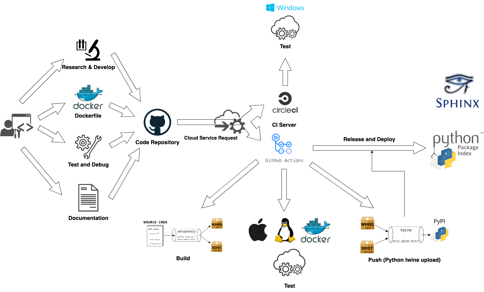

========
CI / CD
========

*SmoothCrawler-Cluster* selects using **GitHub Action** as its CI tool. This section would explain the details of CI processing
for *SmoothCrawler-Cluster*.

Below is the badge of the running state of CI:

|github-actions build-status|

Briefly work flow
==================

Here would show you entire work flow from developers develop *SmoothCrawler-Cluster* in their own local site to the final releasing
the source code to PyPI and releasing the documentation of this package to Sphinx.

Work flow
----------

Do different things in different git branch
--------------------------------------------

It has a little bit different CI processing with different git branch.

+----------------------------------------------------------------+--------------+-----------+----------+
|                  CI processing /\ Git branch                   | *develop/*** | *release* | *master* |
+----------------------------------------------------------------+--------------+-----------+----------+
|1. run test                                                     |       V      |      V    |     V    |
+----------------------------------------------------------------+--------------+-----------+----------+
|2. organize all testing coverage reports and upload it          |       V      |      V    |     V    |
+----------------------------------------------------------------+--------------+-----------+----------+
|3. trigger codacy to verify its code quality                    |       V      |      V    |     V    |
+----------------------------------------------------------------+--------------+-----------+----------+
|4. run pre-build test                                           |       X      |      V    |     V    |
+----------------------------------------------------------------+--------------+-----------+----------+
|5. build git tag and create GitHub release                      |       X      |      X    |     V    |
+----------------------------------------------------------------+--------------+-----------+----------+
|6. compile source code as Python package and push it to PyPI    |       X      |      X    |     V    |
+----------------------------------------------------------------+--------------+-----------+----------+

Details of work flow
=====================

This section provides some simple and briefly develop guide lines to the developers who want to be one of contributors in
this *SmoothCrawler-Cluster* project.

Development
------------

It means developing in your own local site. For the unifying the management of developing, it selects using **Poetry** to
manage *SmoothCrawler-Cluster* project development.

*SmoothCrawler-Cluster* is a package which encapsulates of high fault tolerance features to build crawler cluster. So it
would need to develop and test some feature with third party application like Zookeeper. :ref:`It recommends to use Dokcer
to setup a Zookeeper service <pre-processing>` for developing and testing.

Finally, don't forget update documentation if it needs. The tool for document usage is *Sphinx*. Please refer to its document
or tutorial to get more details. If you want to developing documentation, you could setup the document as HTTP server by *Sphinx*
as following command:

.. code-block:: shell

    >>> poetry run sphinx-autobuild ./smoothcrawler_cluster ./build/html/ --host 127.0.0.1 --port 8080
    ...
    The HTML pages are in build/html.
    [I 230114 23:27:51 server:335] Serving on http://127.0.0.1:8080
    [I 230114 23:27:51 handlers:62] Start watching changes
    [I 230114 23:27:51 handlers:64] Start detecting changes

.. hint::

    Above command should be run at the project's root path.

Therefore, you could access to ``localhost:8080`` and see the documentation as website in your own local site.

Code repository
----------------

It uses **GitHub** as its code repository. And this is all CI processing entry point, in the other words, it would trigger
many processing which be run by CI tool after you push anything to the code repository.

.. note::

    Of course, you should satisfy some rules like the git branch name should be same as the format or the changing files
    should be included in the target files be listened by CI.

CI
---

This processing is an automation which could deeply reduce the development cost and raising the efficiency in development.
For example, it would run all testing under many different scenarios, i.e., testing with different Python version in different
runtime OS. So it could ensure the source code could work finely in many scenarios and let develop only focuses on one scenario
to develop and test.

Here would explain each processing in CI.

Build and configure runtime environment
~~~~~~~~~~~~~~~~~~~~~~~~~~~~~~~~~~~~~~~~

This is a Python library, so it must run test with different Python version under different runtime OS. Therefore, it needs
set and build many different runtime environment for testing.

But for integration test, it needs other components to help to test: Zookeeper service. So it would also setup a Zookeeper
service in CI processing.

Run test
~~~~~~~~~

About the testing in *SmoothCrawler-Cluster*, it divides to 2 types testing: *unit test* and *integration test* and they're
in *test/unit_test* and *test/integration_test* directories. It must need to have *integration test* because it has complex
data pipline with each others. So it must test the features could work finely under reality usage scenarios.

Currently, it uses *PyTest* to building and run test:

.. code-block:: shell

    pytest ./test/unit_test/xxx.py

If it needs, it also could use option ``--reruns 0`` to be more convenience in development.

.. hint::

    If you're developing in your own local site, you could run test through *Poetry* as below:

    .. code-block:: shell

        poetry run pytest ./test/unit_test/xxx.py

Loading testing coverage report to other service
~~~~~~~~~~~~~~~~~~~~~~~~~~~~~~~~~~~~~~~~~~~~~~~~~

After finish running test, it would generate a testing report about the coverage of code be covered by test. This step uploads
these testing reports to service which is free for open source like **CodeCov**, **Coverall** or **Codacy**. They're all good
service for saving and analysing test reports of open source project.

In *SmoothCrawler-Cluster*, it uploads testing reports to `CodeCov <https://about.codecov.io/>`_ and `Codacy <https://www.codacy.com/>`_.

CodeCov
^^^^^^^^

**CodeCov** is a great service for recording and analysing the state of code coverage which be covered by test. It even could
convert the test coverage result as a graph to let developers quickly understand the testing state.

Below is the badge of test coverage result:

|codecov-coverage|

Codacy
^^^^^^^

**Codacy** is a good service for analysing target project's code quality and recording it. And it would judge the code
quality level and let CI processing get fail if it doesn't better than the threshold. Currently, the code quality threshold
of *SmoothCrawler-Cluster* is **A**.

Below is the badge of code quality:

|codacy-level|

CD
---

This is the automation of deploying. In project *SmoothCrawler-Cluster*, its deployment is releasing the source code to `PyPI <https://pypi.org/>`_.
So here would explain the details of project *SmoothCrawler-Cluster*'s deployment.

Add git tag and GitHub release
~~~~~~~~~~~~~~~~~~~~~~~~~~~~~~~

It only has one git branch would run the CD part processing: **master**. However, it would do different things under different scenarios.

It has 3 files for controlling this processing what things it should do: *release-auto-flag.txt*, *release-notes.md*, *release-title.md*.

* *release-auto-flag.txt*
    The flag of whether it should run this section automatically or not. It would run it automatically if flag is *true*.

* *release-title.md*
    The GitHub release title. It only works if the flag *release-auto-flag.txt* is *true*.

* *release-notes.md*
    The GitHub release content. It only works if the flag *release-auto-flag.txt* is *true*.

In this section, it would check the difference of content between current version of * *release-title.md* and previous version
one. If *release-auto-flag.txt* is *true* and the checking result is different, it would keep going ahead to runs after-processing
like add git tag and create GitHub release.

After all it done, it would generate another flag for next processing about whether it should release the source code to PyPI
or not. The checking condition is judging the software version is official version or pre-release version. It only releases if
it is official version.

.. note:: What is official version and pre-release version?

    If the version format is only has integer and dot, its format would like x.x.x, i.e., 0.1.0, 0.1.1, 0.2.0, etc, it is
    **official version**. But if it has other signal or comment like *dev*, *alpha*, *beta*, etc, so the it would look like
    x.x.x-alpha, x.x.xa1, x.x.x-a1, x.x.x-beta1, etc, it is **pre-release** version.

Build source code as package & Push package to PyPI
~~~~~~~~~~~~~~~~~~~~~~~~~~~~~~~~~~~~~~~~~~~~~~~~~~~~

This is the final processing in *SmoothCrawler-Cluster*'s CI. It runs if the flag from previous processing is **Official Release**.
It would compile the source code as Python package by *setup.py* and push it to PyPI. Therefore, we could `see the pacakge in
PyPI <https://pypi.org/project/SmoothCrawler-Cluster/>`_.

.. |github-actions build-status| image:: https://github.com/Chisanan232/SmoothCrawler-Cluster/actions/workflows/ci-cd.yml/badge.svg?branch=master
    :alt: GitHub-Actions building status
    :target: https://github.com/Chisanan232/SmoothCrawler-Cluster/actions/workflows/ci-cd.yml

.. |codecov-coverage| image:: https://codecov.io/gh/Chisanan232/SmoothCrawler-Cluster/branch/master/graph/badge.svg?token=H34TPZQXYL
    :alt: Test coverage with 'codecov'
    :target: https://codecov.io/gh/Chisanan232/SmoothCrawler-Cluster

.. |codecov-graph| image:: https://codecov.io/gh/Chisanan232/SmoothCrawler-Cluster/branch/master/graphs/sunburst.svg?token=H34TPZQXYL
    :alt: Test coverage with 'codecov' as graph
    :target: https://codecov.io/gh/Chisanan232/SmoothCrawler-Cluster

.. |codacy-level| image:: https://app.codacy.com/project/badge/Grade/171272bee2594687964f1f4473628a0f
    :alt: Code Quality by Codacy
    :target: https://www.codacy.com/gh/Chisanan232/SmoothCrawler-Cluster/dashboard?utm_source=github.com&amp;utm_medium=referral&amp;utm_content=Chisanan232/SmoothCrawler-Cluster&amp;utm_campaign=Badge_Grade

