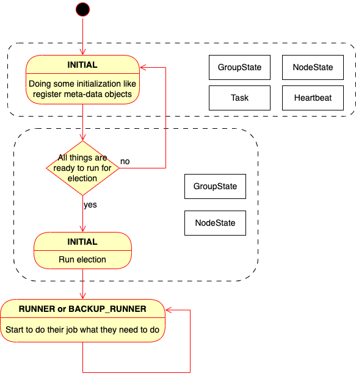
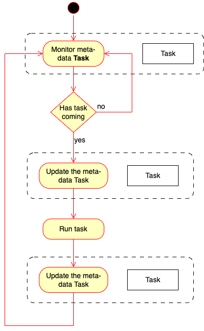

==========
Data Flow
==========

In *SmoothCrawler-Cluster* processing, it has complicated data flow with each others to transfer each one's info about their
running state, heartbeat state, etc, so let entire cluster could run finely without any problem.

This section would explain how the data flow works in *SmoothCrawler-Cluster*.

Data pipline with role
=======================

It has different roles in *SmoothCrawler-CLuster*, so it also has different data flow with different roles. But before it to
be an one specific role, it still transfer something info with each other's or record something like its heartbeat info.

Below is the data flow to demonstrate what meta-data it would operate within a work flow:

Initial Processing
-------------------

First of all, it would register :ref:`all the meta-data it needs <MetaDataModules>`. The registration processing would initial
each one as empty meta-data objects with initial values from crawler if it has. And after it ensure to finish initialization,
it would start to run election.

* Operating meta-data:

  * **GroupState**
  * **NodeState**
  * **Task**
  * **Heartbeat**

Run election
-------------

Before it start to run election, it would verify the meta-data **GroupState** value should be same as its expected, i.e.,
*GroupState.total_crawler* should be same as the sum of crawler's parameters *runner* and *backup*. It would run the election
after it has done verification.

The election would use the values from **GroupState** to do filtering process and make the decision of who is/are **Runner**.
Each one would know their own role and update it in their meta-data **NodeState**.

Therefore, it runs as one specific role after it has done above all things.

* Operating meta-data:

  * **GroupState** (if it is **Runner**):

    * current_crawler
    * current_runner

  * **GroupState** (if it is **Back_Runner**):

    * current_crawler
    * current_backup
    * standby_id

  * **NodeState**:

    * role

Data flow in different roles
------------------------------

.. _RunnerDataFlow:

*Runner*
~~~~~~~~~

If it is **Runner**, its data flow is very simple. It only operates meta-data **Task**.

Monitor task
^^^^^^^^^^^^^

In beginning, it would monitor the meta-data **Task** to check whether it has tasks or not. It only runs after-processing if
it has task, nor it won't do anything and keep monitoring.

* Operating meta-data:

  * **Task**:

    * running_content
    * in_progressing_id

Before run task
^^^^^^^^^^^^^^^^^

It updates the meta-data **Task** first before it runs each one task. If it is the first time to run this tasks, it updates
attributes *running_status* and *in_progressing_id*; otherwise, it updates only one attribute *in_progressing_id*.

* Operating meta-data:

  * **Task**:

    * in_progressing_id
    * running_status

After done task
^^^^^^^^^^^^^^^^

No matter what running result is, it updates the meta-data **task** again after it finishes one of tasks. It updates 2 attributes
*running_result* and *result_details*.

Finally, it would reset the attributes *Task.running_content* and *Task.in_progressing_id* after it finish all tasks.

* Operating meta-data:

  * **Task**:

    * running_content
    * in_progressing_id
    * running_status
    * running_result
    * result_detail

*Back Runner*
~~~~~~~~~~~~~~

If it is **Backup_Runner**, its data flow is more complex than **Runner**. It operates every meta-data in this role's process.

.. image:: ../../../images/flow/data_flow/data_flow_backup_runner.drawio.png

Verify everyone's heartbeat
^^^^^^^^^^^^^^^^^^^^^^^^^^^^^

In beginning, it gets all crawler's name who is **Runner** be meta-data attribute *GroupState.current_runner*, and it would
verify each one's heartbeat info to judge whether they all are alive or not. If it find any problem, it would run after-processing,
nor it won't do anything and keep monitoring everyone's heartbeat info.

* Operating meta-data:

  * **GroupState**:

    * current_runner

  * **Heartbeat**:

    * heart_rhythm_time
    * time_format
    * update_timeout
    * heart_rhythm_timeout

Discover someone is dead
^^^^^^^^^^^^^^^^^^^^^^^^^

If it discover any one of crawlers is dead, it updates the dead one's meta-data **NodeState** and **Heartbeat** to mark it as dead.
It would update *NodeState.role* as **Dead_Runner** and update *Heartbeat.healthy_state*, *Heartbeat.task_state* to be **HeartState.ASYSTOLE**
and the dead one's *Task.running_status* currently.

* Operating meta-data:

  * **NodeState**:

    * role

  * **Heartbeat**:

    * healthy_state
    * task_state

Activate to be *Runner*
^^^^^^^^^^^^^^^^^^^^^^^^

In this process, it updates its own meta-data **GroupState** and **NodeState** to activate itself to be **Runner**.

* Operating meta-data:

  * **NodeState**:

    * role

  * **GroupState**:

    * total_backup
    * current_crawler
    * current_runner
    * current_backup
    * fail_crawler
    * fail_runner
    * standby_id

Hand over the dead one's task
^^^^^^^^^^^^^^^^^^^^^^^^^^^^^^

After it activates itself to be **Runner**, it checks the attribute *Task.running_status* of dead one and hands over it if
the task has not finish yet. So it would copy mostly all **Task** to its own meta-data **Task**.

* Operating meta-data:

  * **Task** (task's *running_state* is **TaskResult.PROCESSING**):

    * entire **Task** object

  * **Task** (task's *running_state* is **TaskResult.NOTHING** or **TaskResult.ERROR**):

    * in_progressing_id
    * running_result
    * result_detail

Run as *Runner*
^^^^^^^^^^^^^^^^

It starts to run as **Runner** from now on. So we could back to refer :ref:`RunnerDataFlow`.

* Operating meta-data:

  * **Task**:
