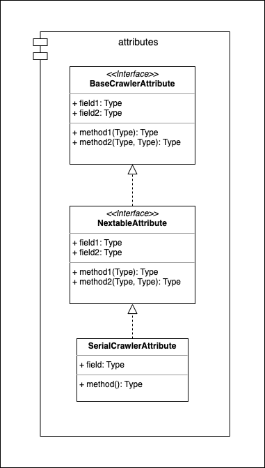

===========
Attributes
===========

* Module: *smoothcrawler_cluster.crawler.attributes*
* API reference: :ref:`Crawler_AttributesAPIRef`

.. _Crawler_Attributes_module_UML:

UML
----

Description
------------

Module *attributes* manage the basic attribute of crawler, e.g., name, identity, etc. Absolutely, the crawler objects in *SmoothCrawler-Cluster*
could let developers to input and pass the arguments about crawler's name into it. However, it would be annoying if you has multiple crawler
instances need to set in multiple runtime environments, i.e., in many Docker containers. So *SmoothCrawler-Cluster* will provide new feature
about developers won't set it anymore, it could auto-set this attribute by package with something properties, e.g., current runtime environment's
IP address, container's identity, etc. So developers could be more convenience to setup a crawler cluster by *SmoothCrawler-Cluster*.

Object:

* :ref:`Crawler_AttributesAPIRef`
