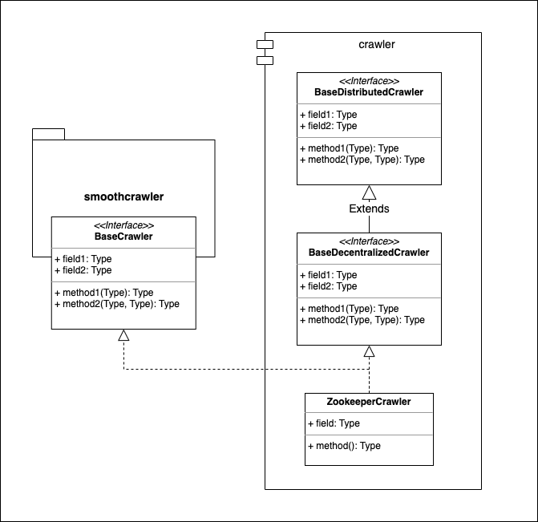
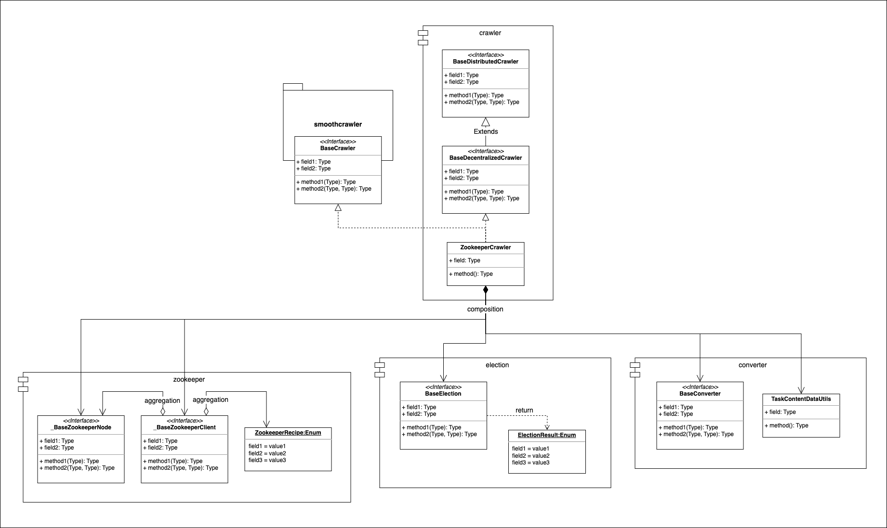

========
Crawler
========

Crawler Module
===============

* Module: *smoothcrawler_cluster.crawler*
* API reference: :ref:`CrawlerAPIRef`

.. _Crawler_module_UML:

UML
----

Description
------------

It has 3 layers of the crawler's extending: **BaseDistributedCrawler**, **BaseDecentralizedCrawler** and *SmoothCrawler*'s
**BaseCrawler**, **ZookeeperCrawler**. We could divide them as below:

* **BaseDistributedCrawler**: Primary base class layer
* **BaseDecentralizedCrawler** and *SmoothCrawler*'s **BaseCrawler**: Second base class layer
* **ZookeeperCrawler**: Implementation layer

*SmoothCrawler-Cluster* is a package which encapsulates some features to let *SmoothCrawler* could have more higher fault
tolerance as a cluster system. But for a cluster system, it could be briefly divided to 2 different types: **Centralize**
and **Decentralize**. So it also follows this concept to design the software architecture of *SmoothCrawler-Cluster*.

Primary base class layer
~~~~~~~~~~~~~~~~~~~~~~~~~

Modules:

* **BaseDistributedCrawler**

This is the base class of all second base classes. However, it just rules the most foundational features about cluster. It
won't have some very clear design or direction to let sub-class to know it should be centralize, decentralize or something
else object.

.. attention::

    Because the primary base class doesn't rule any clear functions to let sub-class could be have more apparently directions,
    it should NOT be extended by *Implementation layer* directly. It ONLY for **Secondary base layer**.

Secondary base class layer
~~~~~~~~~~~~~~~~~~~~~~~~~~~

Modules:

* **BaseCentralizedCrawler**  (would be support in version *0.2.0*)
* **BaseDecentralizedCrawler**
* *SmoothCrawler*'s **BaseCrawler**

The second base classes which extends the primary base one to let its design and direction to be more clear. So the objects
in this layer would be apparently focus on one direction like **centralize cluster** or **decentralize cluster**.

Here layer also includes *SmoothCrawler*'s **BaseCrawler** because all of *SmoothCrawler* should be ruled by it.

.. note::

    This layer is helpful for **Implementation layer** to implement. So all the objects in **Implementation layer** should
    extend **Secondary base class**.

Implementation layer
~~~~~~~~~~~~~~~~~~~~~

Modules:

* **ZookeeperCrawler**

The layer is the crawler implementation. But it won't extend all secondary base classes, it would only extend one of it, i.e.,
**ZookeeperCrawler** only extends **BaseDecentralizeCrawler** and implements its features.

Crawler Module's relation with other modules
=============================================

This is the core of *SmoothCrawler-Cluster* package, so it would be more complicate. Here demonstrate the relation between

.. _Crawler_module_relation_UML:

UML
----

Description
------------

*Crawler* module has aggregation relation with many classes in different modules. Here would clear that which modules is in
the relation and why use it in *crawler* module.

In briefly, it could divide the relationship to be 3 sections of module *crawler.crawlers*:

* *Basic attributes and election*
* *Meta-data operations and communication*
* *Crawler role's responsibility and running*

*Basic attributes and election* (Red square)
~~~~~~~~~~~~~~~~~~~~~~~~~~~~~~~~~~~~~~~~~~~~~

Aggregation with *crawler.attributes* module
^^^^^^^^^^^^^^^^^^^^^^^^^^^^^^^^^^^^^^^^^^^^^

To generate crawler's basic attributes, e.g., name, identity, etc, for running **Runner** election.

Aggregation with *election* module
^^^^^^^^^^^^^^^^^^^^^^^^^^^^^^^^^^^

About running **Runner** election, it would use the strategy in *election* module to run.

*Meta-data operations and communication* (Grey square)
~~~~~~~~~~~~~~~~~~~~~~~~~~~~~~~~~~~~~~~~~~~~~~~~~~~~~~~

Aggregation with *_utils.zookeeper* module
^^^^^^^^^^^^^^^^^^^^^^^^^^^^^^^^^^^^^^^^^^^

Crawler would use *zookeeper* module to build session and do some operations with Zookeeper.

Aggregation with *_utils.converter* module
^^^^^^^^^^^^^^^^^^^^^^^^^^^^^^^^^^^^^^^^^^^

All the meta-data objects would be processed by *converter* module.

Aggregation with *crawler.adapter* module
^^^^^^^^^^^^^^^^^^^^^^^^^^^^^^^^^^^^^^^^^^

For some special operations, i.e., operate something with one specific node synchronously (with a distributed lock).

*Crawler role's responsibility and running* (Blue square)
~~~~~~~~~~~~~~~~~~~~~~~~~~~~~~~~~~~~~~~~~~~~~~~~~~~~~~~~~~

Aggregation with *crawler.workflow* module
^^^^^^^^^^^^^^^^^^^^^^^^^^^^^^^^^^^^^^^^^^^

To run the specific crawler role's jobs. For objects in *crawler.crawlers* module, it could use it directly without any checking or something else.

Aggregation with *crawler.dispatcher* module
^^^^^^^^^^^^^^^^^^^^^^^^^^^^^^^^^^^^^^^^^^^^^

The dispatcher who takes care which workflow the crawler should call and use it by crawler's role. For objects in *crawler.crawlers* module, it needs
get the needed workflow through *crawler.dispatcher* module to dispatch for crawler.

.. note::

    About the details of the relationship between modules *dispatcher*, *workflow* and *crawler*, please refer to below links to get more info:

    * :ref:`Software architecture of module *crawler.dispatcher* <DevelopmentDoc_SA_Crawler_Dispatcher>`
    * :ref:`Software architecture of module *crawler.workflow* <DevelopmentDoc_SA_Crawler_Workflow>`
