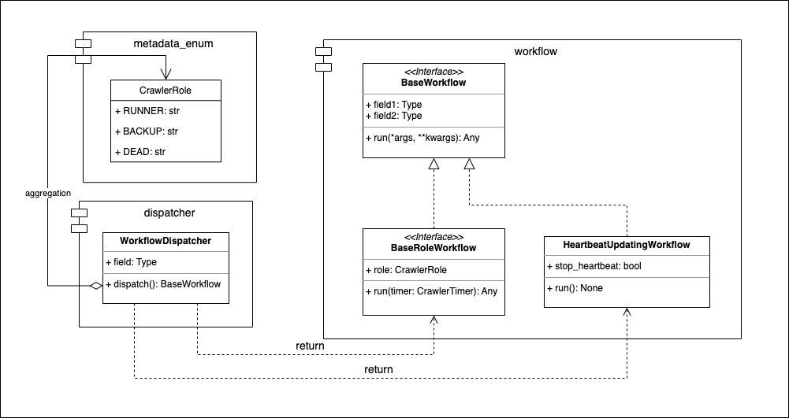

===========
Dispatcher
===========

* Module: *smoothcrawler_cluster.crawler.dispatcher*
* API reference: :ref:`Crawler_DispatcherAPIRef`

.. _Crawler_Dispatcher_module_UML:

UML
----

Description
------------

This is a dispatcher in this package to help the objects in *crawler.crawlers* module to get the needed workflow. In *SmoothCrawler-Cluster*,
it has many crawler roles with different scenarios and each different crawler role has their own responsibility to do something jobs.

Module *workflow* manage these various and complex jobs implementation, they only take care what things they need to do and how to do it, but
they don't care who calls and used them. So module *dispatcher* is the one who **takes care which workflow (derail jobs) who (crawler roles)
should calls and could uses it**. Therefore, for module *crawler*'s point, it doesn't need to care what jobs it needs to do or how to do it, it
even doesn't care how to call them, It only let module *dispatcher* dispatch someone *workflow* to it and use it directly.

Object:

* :ref:`Crawler_DispatcherAPIRef`
