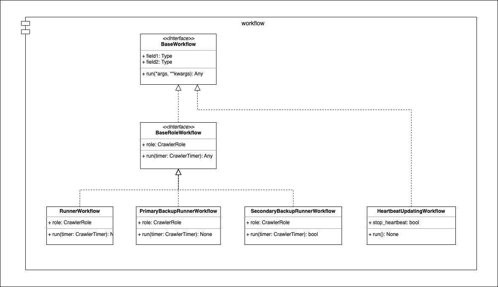

==========
Workflow
==========

* Module: *smoothcrawler_cluster.crawler.workflow*
* API reference: :ref:`Crawler_WorkflowAPIRef`

.. _Crawler_Workflow_module_UML:

UML
----

Description
------------

It has 2-3 layers in the software architecture in module *crawler.workflow*: **Base workflow**, **Base crawler role workflow** and **Implementation**.

**Base workflow**
~~~~~~~~~~~~~~~~~~

The class in this layer defines the most basic function a workflow class must to have. It won't have any property or implemented function.

Object:

* :ref:`Crawler_WorkflowAPIRef_BaseWorkflow`

**Base crawler role's workflow**
~~~~~~~~~~~~~~~~~~~~~~~~~~~~~~~~~~

This is also a base class about extending the feature of above one. The class of this layer has a property *role* about what the crawler
role current crawler instance's is.

Object:

* :ref:`Crawler_WorkflowAPIRef_BaseRoleWorkflow`

**Implementation**
~~~~~~~~~~~~~~~~~~~~

Literally, all the classes in this layer are implementation of one of base classes. And they also are the target which would be dispatched by
the objects in *crawler.dispatcher* module.

Object:

* The implementations of **Base workflow** directly

  * :ref:`Crawler_WorkflowAPIRef_HeartbeatUpdatingWorkflow`

* The implementations of **Base crawler role's workflow**

  * :ref:`Crawler_WorkflowAPIRef_RunnerWorkflow`
  * :ref:`Crawler_WorkflowAPIRef_PriBackupWorkflow`
  * :ref:`Crawler_WorkflowAPIRef_SecBackupWorkflow`
