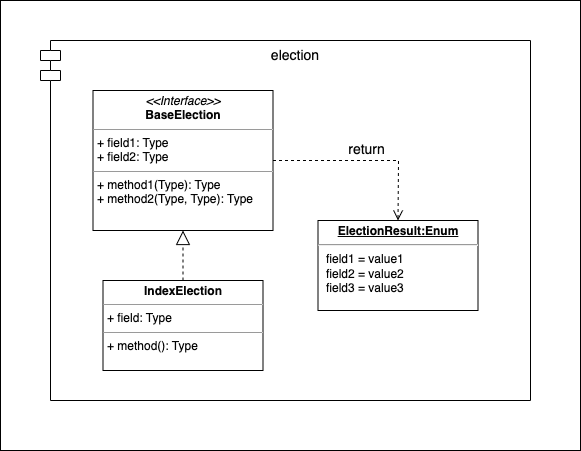

=========
Election
=========

* Module: *smoothcrawler_cluster.election*
* API reference: :ref:`ElectionAPIRef`

.. _Election_module_UML:

UML
----

Description
------------

This is a strategy for *crawler* module. It controls how to run the **Runner** election of crawler instances. And it would
return an enum object **ElectionResult** as final result of the election.
