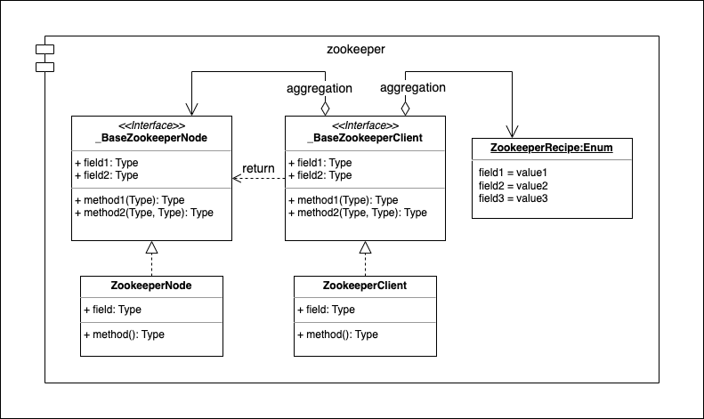
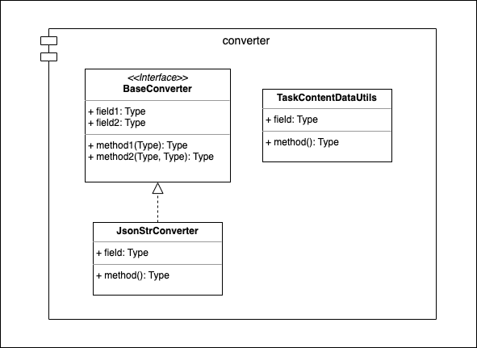

======
Utils
======

The sub-pacakge *smoothcrawler_cluster._utils* is literally, it's the util functions for pacakge self. However, it usually
cannot cover some features by these util functions, so it must to be flexible and scalable to let every developers to extend
its features to satisfy many different scenarios.

Zookeeper
==========

* Module: *smoothcrawler_cluster._utils.zookeeper*
* API reference: :ref:`Inner Modules / Zookeeper <UtilZookeeperAPIRef>`

.. _Util_Zookeeper_module_UML:

UML
----

Description
------------

It has 2 base classes in *zookeeper* module:

* **_BaseZookeeperClient**
* **_BaseZookeeperNode**

**_BaseZookeeperClient** is the main body of building a session and operating with Zookeeper. The getting function in it would
request you must to return another base class **_BaseZookeeperNode**.

Converter
==========

* Module: *smoothcrawler_cluster._utils.converter*
* API reference: :ref:`Inner Modules / Converter <UtilConverterAPIRef>`

.. _Util_Converter_module_UML:

UML
----

Description
------------

It has template functions in base class **BaseConverter**, so the sub-class of it only implements the details which be defined
as abstract functions. And for client site (caller object), it could call the template functions directly to do something it
needs. In the other words, it's easy to let you customize it with other data format, e.g., XML, Properties, etc, and easily
replace it without modifying any code in caller object.
