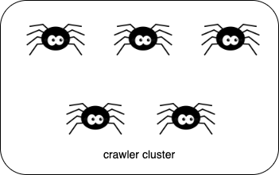
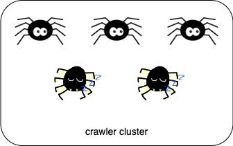
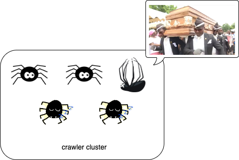
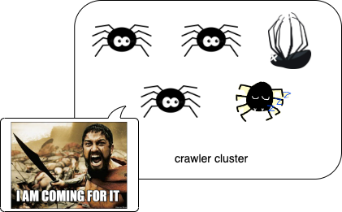
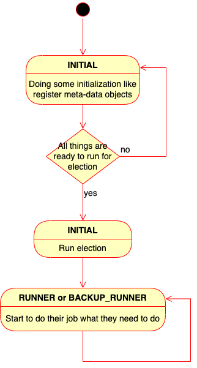

==========
Introduce
==========

*SmoothCrawler-Cluster* is a Python library which encapsulates cluster features for crawler, aka web spider, to let developers
could design and build a crawler cluster easily and could be easy and humanly for develop and maintain.

Regardless of *SmoothCrawler* or *SmoothCrawler-Cluster*, they all provide a direction how to design and build crawler, the
former for general usage, the latter for usage in cluster.

.. seealso::

    If you're new in *SmoothCrawler* and doesn't know what it is, please refer to `What is SmoothCrawler`_ to more understand
    of it.

.. _What is SmoothCrawler: https://smoothcrawler.readthedocs.io/en/latest/introduction.html

So what exactly *SmoothCrawler-Cluster* want to do? This question could be aligned with **what cluster concern want to resolve**?
In a nutshell, one of issues what cluster want to resolve is: let program or system to be more better of fault tolerance to ensure
system could keep running and as doesn't have any problems to user when it occurs problems. Therefore, *SmoothCrawler-Cluster* want
to help developers design and implement a crawler which has high fault tolerance humanly.

Let's briefly explain that how the crawler program would run with *SmoothCrawler-Cluster*.

How it run
===========

First, let's assume that it has 5 single crawler instances and they are in the same group as a crawler cluster.

In current version, it would run an election to decide to which is/are **Runner** and the rest is/are **Backup Runner**.
Here we assume that it would elect 3 **Runner** and the rest 2 ones are **Backup Runner**.

However, it occurs something wrong and it leads to one of crawler instances to be dead.

After it exists dead **Runner**, that issue would be detected by **Backup Runner** and activate to be **Runner** by itself.

Therefore, the **Runner** which is original **Backup Runner** would hand over the task from dead **Runner** if it has. Finally,
it would keep running as **Runner** from now on.

Above demonstrate how it works in *SmoothCrawler-Cluster*, so let's explain the brief of work flow further.

Brief of work flow
===================

Now, we know how it works about fault tolerance. Here would show you the brief of work flow:

Before running, it would run election first to decide to which is/are **Runner**. And before it run an election, it should
create and register the meta data objects first.

Every instances should be explore its self info and check other's info to let cluster could judge to do right things and run finely.
So finally these crawler instances converges to a stable state --- **Runner** and **Backup Runner** has been setup and they all has
been doing their own job finely.

.. seealso::

    If you're curious and want to get more details of work flow, please refer to :ref:`WorkFlow` to get more info.

How it should be easily written as
===================================

Here would demonstrate a sample code with *SmoothCrawler-Cluster* usage to you.

Absolutely, you need to implement the SmoothCrawler components first.

.. seealso::

    About *SmoothCrawler* components, please refer to `How to use and implement SmoothCrawler component`_ to get more detail.

.. _How to use and implement SmoothCrawler component: https://smoothcrawler.readthedocs.io/en/latest/quickly_start.html#implement-components

After you done the component implementations, it's nothing special of usage. It also instantiates crawler and run it as below:

.. code-block:: python

   from smoothcrawler_cluster import ZookeeperCrawler

   # Instantiate some crawlers with Zookeeper
   zk_crawler = ZookeeperCrawler(runner=2,
                                 backup=1,
                                 ensure_initial=True,
                                 zk_hosts="localhost:2181")
   # Same as SmoothCrawler general usage, register the components into factory
   zk_crawler.register_factory(http_req_sender=RequestsHTTPRequest(),
                               http_resp_parser=RequestsExampleHTTPResponseParser(),
                               data_process=ExampleDataHandler())
   # Listen and wait for tasks
   zk_crawler.run()

The a little bit different is: before you instantiate crawler, you should make sure whether the Zookeeper service is accessible or not.

Finally, current version only supports one crawler --- **ZookeeperCrawler**. It would keep improving and developing this package to
let developers has more choices and humanly to use it.
