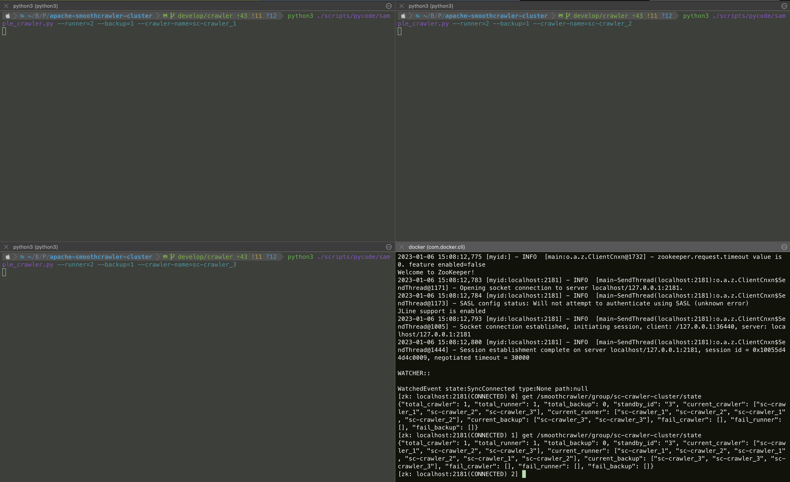

==============
Quickly Start
==============

As a software engineer, I believe that you are full of curious of *SmoothCrawler-Cluster* and also can't wait to learn
how to use it! This page would show you how easy the usage is. Before start with *SmoothCrawler-Cluster*, please make
sure that you have already :ref:`installed it <Installation>`.

.. _pre-processing:

Before everything ...
-----------------------

In exactly, before start with *SmoothCrawler-Cluster*, apart from installation, we also need to make sure that activating
Zookeeper service which you could access to if we need to quickly start with **ZookeeperCrawler**. Please refer to
:ref:`how meta data important is in cluster <>` for get more detail why we need it.

Manage meta-data by Zookeeper
~~~~~~~~~~~~~~~~~~~~~~~~~~~~~~

It needs to activate Zookeeper service because the crawler cluster would let Zookeeper to manage its all meta-data. So
below are simple tutorial for setup Zookeeper service.

By the way, it suggests to setup and run Zookeeper through **container**, e.g., Docker.

Activate service in Linux host
^^^^^^^^^^^^^^^^^^^^^^^^^^^^^^^

If you want to setup service directly in your environment of host, please make sure that *Java* has been installed in it.

.. code-block:: shell

    >>> java -version
    openjdk version "1.8.0_345"
    OpenJDK Runtime Environment (Zulu 8.64.0.19-CA-macos-aarch64) (build 1.8.0_345-b01)
    OpenJDK 64-Bit Server VM (Zulu 8.64.0.19-CA-macos-aarch64) (build 25.345-b01, mixed mode)

And than, we could divide to 2 types of OS runtimes of host to setup: *Linux* and *MacOS*.

Linux OS
"""""""""

Download the latest version of Zookeeper and decompress it.

.. code-block:: shell

    >>> curl https://dlcdn.apache.org/zookeeper/zookeeper-3.8.0/apache-zookeeper-3.8.0.tar.gz --output /
    >>> tar zxvf /apache-zookeeper-3.8.0.tar.gz

In the directory we decompressed, it has everything we need to setup Zookeeper service. We also could find the sample
configuration in directory ``/apache-zookeeper-3.8.0/conf`` and file name is ``zoo_sample.cfg``.

Here is another sample config you could use::

    dataDir=/data
    dataLogDir=/datalog
    tickTime=1000000
    initLimit=10
    syncLimit=6
    autopurge.snapRetainCount=3
    autopurge.purgeInterval=0
    maxClientCnxns=100000000
    standaloneEnabled=true
    admin.enableServer=true
    server.1=localhost:2888:3888;2181

In default, it would try to find the configuration file which names ``zoo.cfg`` for activating Zookeeper service, so
we could rename the sample configuration file or create new one and use above example settings.

After we finish preparing of configuration, let's start to setup Zookeeper service:

.. code-block:: shell

    >>> bin/zkServer.sh start

It should work finely and doesn't have any error message. We could use shell which Zookeeper provides to verify its status:

.. code-block:: shell

    root@d8e0a4b0c3f4:/apache-zookeeper-3.8.0-bin# ./bin/zkServer.sh status
    ZooKeeper JMX enabled by default
    Using config: /conf/zoo.cfg
    Client port found: 2181. Client address: localhost. Client SSL: false.
    Mode: standalone

We just quickly start how to use **ZookeeperCrawler** with Zookeeper, so it's fine of using ``standalone`` mode.

Finally, we could stop the service through below command line:

.. code-block:: shell

    >>> bin/zkServer.sh stop

.. note::

    Please refer to `Zookeeper Documentation`_ to get more detail.

.. _Zookeeper Documentation: https://zookeeper.apache.org/doc/r3.3.3/zookeeperStarted.html#sc_Prerequisites

Mac OS
"""""""

If you're a developer and works with MacOS, it's great to do mostly same things as Linus. However, we would use ``Homebrew``
to install here. So before start this section, please make sure you has been `installed it <https://brew.sh/>`_.

.. note::

    For a developer as user of MacOS, I believe you must know what is ``Homebrew`` --- the greatest tool for user of MacOS
    to manage every open source packages or software applications. Please refer to `Homebrew document`_ to get more details.

.. _Homebrew document: https://docs.brew.sh/

Before run Zookeeper installation by ``Homebrew``, we need to install ``xcode-select`` first.

.. code-block:: shell

    $ xcode-select --install

And we could install Zookeeper by ``Homebrew`` very easily:

.. code-block:: shell

    $ brew install zookeeper

Let's setup service:

.. code-block:: shell

    $ zkServer start

Verify the service status:

.. code-block:: shell

    $ zkServer status

It absolutely could stop the service by command:

.. code-block:: shell

    $ zkServer stop

Activate service in docker container
^^^^^^^^^^^^^^^^^^^^^^^^^^^^^^^^^^^^^

I believe I don't need to introduce and explain how great and good to use in software development Docker is.

First, we need to download the Docker image of Zookeeper with latest version *3.8.0*:

.. code-block:: shell

    >>> docker pull zookeeper:3.8.0

Verify the image info to make sure we download it correctly:

.. code-block:: shell

    >>> docker images
    REPOSITORY        TAG          IMAGE ID        CREATED         SIZE
    zookeeper         3.8.0        7xxxxxxxxxx2    1 minute ago    266MB

Let's run a container to setup Zookeeper service with the image we has downloaded:

.. code-block:: shell

    >>> docker run --name some-zookeeper -e ZOO_MAX_CLIENT_CNXNS=100000000 --restart always -p 2181:2181 -d zookeeper:3.8.0
    dxxxxxxxxx4

The container would run in background because of option ``-d``. And the option ``-e`` means we set a environment variable
``ZOO_MAX_CLIENT_CNXNS`` into container.

.. attention::

    Please remember export the port ``2181`` to let outside could access to it.

    We could verify whether the service in container is accessible or not through tool ``nc`` as below usage:

    .. code-block:: shell

        >>> nc -zv localhost 2181
        Connection to localhost port 2181 [tcp/eforward] succeeded!

We could check the container brief status through below command:

.. code-block:: shell

    >>> docker container ps -a
    CONTAINER ID   IMAGE             COMMAND                  CREATED       STATUS       PORTS                                                  NAMES
    dxxxxxxxxx4   zookeeper:3.8.0   "/docker-entrypoint.…"   1 minute ago   Up 2 minute   2888/tcp, 3888/tcp, 0.0.0.0:2181->2181/tcp, 8080/tcp   some-zookeeper

And if we need, we also could check the log message through option ``logs``:

.. code-block:: shell

    >>> docker logs -f some-zookeeper

.. note::

    If you're interesting in the details of Zookeeper, please refer to `Zookeeper Docker`_ to get more detail what you
    want to know.

.. _Zookeeper Docker: https://hub.docker.com/_/zookeeper

Start to develop cluster crawler
---------------------------------

ZookeeperCrawler is your good friend
~~~~~~~~~~~~~~~~~~~~~~~~~~~~~~~~~~~~~

If you select to start with **ZookeeperCrawler**, you should have done :ref:`pre-processing <pre-processing>` and finally
could know how to use *SmoothCrawler-Cluster* to develop crawler cluster with it.

First of all, we need to import our protagonist of this section --- **ZookeeperCrawler**:

.. code-block:: python

    from smoothcrawler_cluster import ZookeeperCrawler

It assumes that we want to build a small crawler system which has 3 crawlers and 2 of them are **Runner** and another one is
**Backup Runner**. So let's instantiate a crawler with option ``runner=2`` and ``backup=1`` (these 2 options are required) as
below:

.. code-block:: python

    zk_crawler = ZookeeperCrawler(runner=2,
                                  backup=1,
                                  zk_hosts="localhost:2181")

If your Zookeeper has been setup in localhost, you could ignore pass option ``zk_hosts`` because it would try to connect to
``localhost:2181`` in default (the default value is *None* of option ``zk_hosts``). But here we need to show you the clear
settings you need so that we still pass a value at the option.

If you ever use *SmoothCrawler* before, I believe you won't forget register every needed components to this crawler:

.. code-block:: python

   zk_crawler.register_factory(http_req_sender=RequestsHTTPRequest(),
                               http_resp_parser=RequestsExampleHTTPResponseParser(),
                               data_process=ExampleDataHandler())

.. admonition:: todo

    You should implement each SmoothCrawler components here. Please refer to `how to implement SmoothCrawler's components`_
    to clear what's the SmoothCrawler component and how to implement it.

.. _how to implement SmoothCrawler's components: https://smoothcrawler.readthedocs.io/en/latest/quickly_start.html#implement-components

Finally, let's start to run the crawler!

.. code-block:: python

   zk_crawler.run()

.. caution::

    If you want to run the crawler continuously, rather run it in a for loop to keep it running, you should use function
    ``run``.

    However, if you just want to run tasks one by one via loop, e.g., *for*, etc, you should use ``processing_crawling_task``.
    But I really really really doesn't suggest you to do that because you won't experience how great *SmoothCrawler-Cluster* is.

Run as really cluster
~~~~~~~~~~~~~~~~~~~~~~

If it according plan, you should never run the crawler cluster successfully. Why? It cannot work because we only run ONE
instance and **ZookeeperCrawler** has timeout setting in default. Don't forget, we're testing the feature of crawler **cluster**,
so we need to run 3 crawler instances. But before we open multiple terminates to run it, we also have to do one thing ---
parameterize the crawler name. If we don't do that, we would need to have 3 same codes with only different crawler name at
option ``name``.

So let's parameterize some values with Python library *argparse*:

.. code-block:: python

    import argparse

    parser = argparse.ArgumentParser(description="A sample crawler in cluster")
    parser.add_argument('--runner', type=int, default=None)
    parser.add_argument('--backup', type=int, default=None)
    parser.add_argument('--crawler-name', type=str, default="sc-crawler_1")
    args = parser.parse_args()

    _RUNNER_CRAWLER_VALUE = args.runner
    _BACKUP_CRAWLER_VALUE = args.backup
    _CRAWLER_NAME = args.crawler_name

Above code could let you run the Python script file with several specific parameters.

Now, please open multiple terminates and run 3 instances with their own parameters.

.. code-block:: shell

    >>> python3 sample_crawler.py --runner=2 --backup=1 --crawler-name=sc-crawler_1

.. attention::

    Again, each different terminates should run with different crawler name.

Right now, you should run the crawler cluster successfully and you could verify the meta-data should be saved correctly in
Zookeeper.

Let's check it by Zookeeper client tool.

.. code-block:: shell

    root@d8e0a4b0c3f4:/apache-zookeeper-3.8.0-bin# ./bin/zkCli.sh
    Connecting to localhost:2181
    ...
    Welcome to ZooKeeper!
    ...
    WatchedEvent state:SyncConnected type:None path:null
    [zk: localhost:2181(CONNECTED) 0]

First of all, the most important info must be ``/smoothcrawler/group/<group name>/state`` because it means the whole cluster
state.

.. code-block:: shell

    [zk: localhost:2181(CONNECTED) 2] get /smoothcrawler/group/sc-crawler-cluster/state
    {"total_crawler": 3, "total_runner": 2, "total_backup": 1, "standby_id": "3", "current_crawler": ["sc-crawler_1", "sc-crawler_2", "sc-crawler_3"], "current_runner": ["sc-crawler_1", "sc-crawler_2", "sc-crawler_1", "sc-crawler_2", "sc-crawler_1", "sc-crawler_2"], "current_backup": ["sc-crawler_3", "sc-crawler_3", "sc-crawler_3"], "fail_crawler": [], "fail_runner": [], "fail_backup": []}

From above info, you could clearly see that total amount of crawler is 3, total amount of **Runner** role crawler is 2 and
they're *sc-crawler_1* and *sc-crawler_2*, total amount of **Backup Runner** is 1 and it's *sc-crawler_3*.

Therefore, we could make sure that the crawler cluster works finely!

Trigger the crawler running
~~~~~~~~~~~~~~~~~~~~~~~~~~~~

You may be confuse one thing: so how can I trigger the crawlers to do crawl data from website?

It's very easy! Just set the task content into Zookeeper node ``/smoothcrawler/node/<crawler name>/task``.

We would need to use *kazoo* for building session with Zookeeper and **Initial** and **RunningContent** for creating a
meta-data **Task** object.

.. code-block:: python

    from kazoo.client import KazooClient
    from smoothcrawler_cluster.model import Initial, RunningContent
    import json

Creating a **Task** meta-data object:

.. code-block:: python

    content = RunningContent(task_id=0, url="https://www.example.com", method="GET", header={}, parameters={}, body={})
    task = Initial.task(running_content=[content])

Build a Zookeeper session and set the **Task** value to one specific crawler, e.g., ``smoothcrawler/node/sc-crawler_1/task``:

.. code-block:: python

    client = KazooClient(hosts="localhost:2181")
    client.start()
    client.set(path="smoothcrawler/node/sc-crawler_1/task", value=bytes(json.dumps(task.to_readable_object()), "utf-8"))
    client.close()

Now, you could see that crawler would run the task and update the running result back to meta-data **Task**. Above one is
before run task and below one is after run task, you could observe the different between them:

* Before run task

.. code-block:: shell

    [zk: localhost:2181(CONNECTED) 2] get /smoothcrawler/node/sc-crawler_1/task
    {"running_content": [], "cookie": {}, "authorization": {}, "in_progressing_id": "-1", "running_result": {"success_count": 0, "fail_count": 0}, "running_status": "nothing", "result_detail": []}

* After run and finish the task

.. code-block:: shell

    [zk: localhost:2181(CONNECTED) 3] get /smoothcrawler/node/sc-crawler_1/task
    {"running_content": [], "cookie": {}, "authorization": {}, "in_progressing_id": "-1", "running_result": {"success_count": 1, "fail_count": 0}, "running_status": "done", "result_detail": [{"task_id": 0, "state": "done", "status_code": 200, "response": "Example Domain", "error_msg": null}]}

You could observe that 3 options has been changed: ``running_result``, ``running_status`` and ``result_detail``.

``running_result`` is a statistics of all task running state, here has one success_count because of the task we set.

``running_status`` turn to be *done* because it receive a task and finish it.

``result_detail`` is the most important option because it records the details of running result. So all what you want would
be here. You could see that it crawling result is ``Example Domain``.

That's all how to quickly start with *SmoothCrawler-Cluster*. Hope you could enjoy it and build your own crawler cluster with it!
