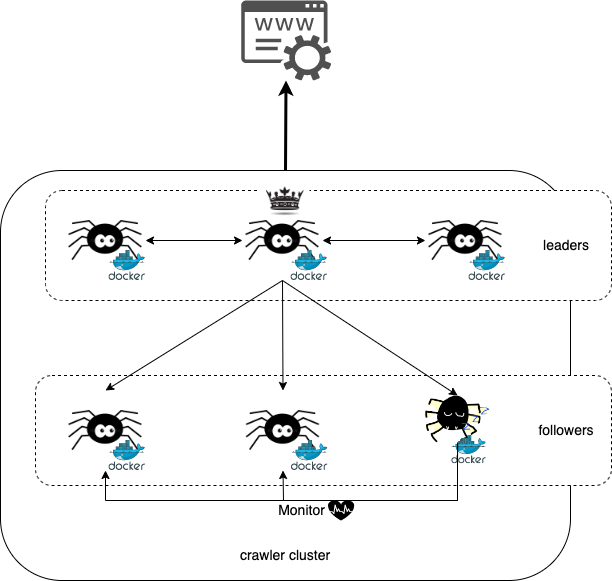

=================
Follower (Slave)
=================

It is the crawler instance who receives order from **Leader** to do something. About the **Follower** existence meaning, it is mostly
same as the **Runner** in the no-leader usage. In other words, it is the one who is responsible of running all orders which be given
by **Leader**. And what kind of commands it should do depend on what role it is in cluster.

Responsibility
===============

Here it would explain the details what things it should do as each different roles.

*Runner*
---------

**Runner** is same as the definition of enum value *CrawlerStateRole.RUNNER* in :ref:`CrawlerStateRoleAPIRef`.

*Backup Runner*
----------------

**Backup Runner** is also mostly same as the definition of enum value *CrawlerStateRole.BACKUP_RUNNER* in :ref:`CrawlerStateRoleAPIRef`.
The only difference is who monitor **Runner** crawler instance. So let's discussion it in different scenarios as following.

Monitor *Runner* by itself
~~~~~~~~~~~~~~~~~~~~~~~~~~~

It monitors the **Runner** state by **Backup Runner**. So the relation in infra would be like as below:

The running would be same as usage *no leader in cluster as* :ref:`SomeAreRunner`. The main body to run the monitoring is **Backup Runner**.

Monitor *Runner* by its leader
~~~~~~~~~~~~~~~~~~~~~~~~~~~~~~~

It monitors the **Runner** state by **Backup Runner**'s **Leader**. So the relation in infra would be like as below:

**Leader** would help **Backup Runner** to monitor other **Runner**'s running state, and it would notify **Backup Runner** needs
to activate to replace the dead **Runner** and hand over its task to run. So the **Backup Runner** only waits for the notification
from **Leader**.
