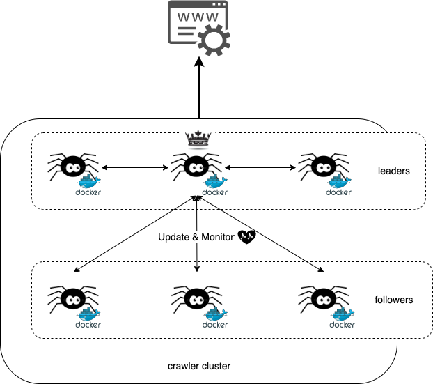

.. _Has_Leader_usage_guide:

===========
Has Leader
===========

.. include:: ../summary_leader_design.rst

.. attention::

    It doesn't support the usage for this scenario currently.

The direction of this section is **it has leader in cluster**. The infra of usage would be like:

It has 2 level in cluster: **Leader** (or **Master**) and **Follower** (or **Slave**). No matter **Leader** or **Follower**, they still
has roles: **Runner** or **Backup**. That's the reason why you could see the crown on one specific **Leader** crawler instance, it has
responsibility of giving **Follower** crawler instances order to do something, i.e., run task or stand by for running task.

Please refer to sections below to get more details of each levels:

.. toctree::
   :maxdepth: 2
   :titlesonly:

   leader
   follower

