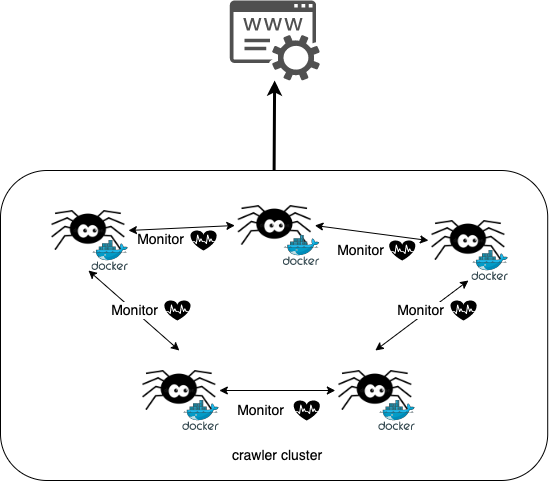

=================
All are *Runner*
=================

One of **decentralized** usage is: all of them are **Runner**. So they also are the **Backup Runner** of each others. More clearly
speaking, any one of them is dead, others would detect it and hand over its tasks to keep running.

.. attention::

    It doesn't support the usage for this scenario currently.

Infra
======

Let's demonstrate the infra of this usage case.

Assume each crawler instances run in different single container. It's obvious that it has 5 **Runner** crawlers, and it ONLY
has **Runner** crawler. Put differently, all the crawler instances would run tasks and on one does the **Backup Runner**'s job.
They're **Runner** to run task, and they also are **Backup Runner** of each others could hand over dead one's task at any time
to ensure the cluster could work finely without any problem.

How to use?
============

Let's demonstrate how to implement with *SmoothCrawler-Cluster* for this usage case.

About **ZookeeperCrawler**, you need to pass ONLY one argument ``runner`` to initial cluster.

.. code-block:: python

    from smoothcrawler_cluster import ZookeeperCrawler

    zk_crawler = ZookeeperCrawler(runner=5,
                                  name="crawler_<index>",
                                  zk_hosts="localhost:2181")

In this usage case, it won't run election because every one is **Runner**. It won't make decision about who is/are **Runner** and
who is/are **Backup Runner**. So it won't run election in instantiate process.

Prods and cons
===============

Advantages
-----------

* No election for choosing **Runner** so it could be more faster to run.
* Can pull out all the spots to run task. In other words, it could run more tasks in the same time.

Disadvantages
--------------

* Need to be careful of avalanche effect.
* The responsibility of the roles in this usage is not simple, it would need to handle more things than the roles in usage :ref:`SomeAreRunner`.

.. note:: What is avalanche effect?

    Let's think about one thing: cluster has over loading tasks so that one of crawler instance crash. However the dead one's task
    would be handed over by others and it leads to other's resource needs to face more ordeals, and unfortunately, it may also crash
    finally. So one after another, all crawler instances would crash finally.

    By the way, it has many different possibilities of the crash root cause, e.g., over loading of parsing calculating, too frequent
    to send HTTP request, etc.
