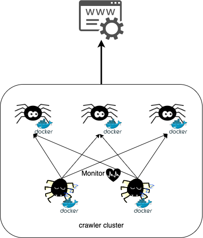

.. _SomeAreRunner:

==================
Some are *Runner*
==================

One of **decentralized** usage is: some of them is/are **Runner**. Therefore, in this usage case, it has 2 different roles in
the cluster **Runner** and **Backup Runner**. Let's explain the details of this usage and how to use it.

Infra
======

Let's demonstrate the infra of this usage case.

Assume each crawler instances run in different single container. It's obvious that it has 3 **Runner** to run all tasks in cluster
and it also has 2 **Backup Runner** to keep monitoring other 3 **Runner** and stand by for replacing it to run.

Therefore, the truly task runners are the 3 **Runner** instances, and the rest, the 2 **Backup Runner** crawlers won't join the
task running, they only stand by for handing over **Runner** crawler's task if it's dead to ensure the cluster could keep running
without any problem.

How to use?
============

Let's demonstrate how to use *SmoothCrawler-CLuster* to implement for this usage scenario.

About **ZookeeperCrawler**, you need to pass arguments ``runner`` and ``backup`` to configure cluster.

.. code-block:: python

    from smoothcrawler_cluster import ZookeeperCrawler

    zk_crawler = ZookeeperCrawler(runner=3,
                                  backup=2,
                                  name="crawler_<index>",
                                  zk_hosts="localhost:2181")

In default, it would run election to decide to who is/are **Runner** in instantiate process. So it already be one specific role
when you do anything with the instance ``zk_crawler``, e.g., start to run this crawler.

.. code-block:: python

    zk_crawler.run()

Prods and cons
===============

Advantages
-----------

* If the target HTTP server cannot load big amount of traffic or it has limitation of traffic, this usage could save more resource.
* The responsibility of each role is pure. They only focus on one thing.

Disadvantages
--------------

* It needs to run election for choosing **Runner** so it also needs more time to run because of convergence for **Runner**.
* Cluster cannot make all-out effort to run task.
